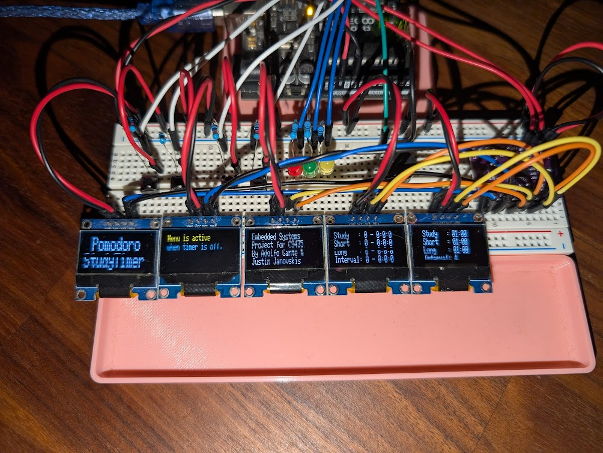

# Pomodoro Study Timer
### Embedded Systems Project

## Preface

A Big thank you the developer of [Pomofocus](https://pomofocus.io/). In my
opinion is the most polished, convenient and pleasing implementation. The 
insporation the my attempt at a hardware based implementation of the Pomodoro 
Technique. It was especially helpful while I was using it for this project.

The purpose of the project was to design, build, and program an embedded system 
for my Embedded Systems class. My goal for the project was to have a useful, 
purpose built device that would be an active good in my life. As someone who
struggles to focus (I'm sure many can relate) the Pomodoro Technique has been
a huge help, in both promoting pure focus time and curving mental fatigue.

## Introduction

### Background

> The Pomodoro Technique is a time management method developed by Francesco Cirillo in the late 1980s. It uses a kitchen timer to break work into intervals, typically 25 minutes in length, separated by short breaks. Each interval is known as a pomodoro, from the Italian word for tomato, after the tomato-shaped kitchen timer Cirillo used as a university student. -- [Wikipedia](https://en.wikipedia.org/wiki/Pomodoro_Technique)

It is an extreamly useful tool for studying and highly recommened for the
"get it done the day before" procrastinator (i.e. myself).

### Reference material

Of cource I am not the first to think of making a hardware based Pomodoro Timer.
Someone has done it before and someone will do it again. As research, a simple 
google search returns [Make a Pomodoro Study Clock](https://www.sciencebuddies.org/science-fair-projects/project-ideas/Elec_p099/electricity-electronics/pomodoro-study-clock).
It's difficulty is marked as *Intermediate Hard*. For the average CompSci
student, me, it was a fun tutorial and encourages you to expand on the project
which I did!

### Design of the system

What is a Pomodoro Study Timer? A counter down timer, buttons and some method of
displaying that timer. I suppose you need a computer to run it all as well.
Personally, I like an obvious visual change and auditory cue so LEDs and a 
buzzer would work well.

Aurdino has become ubiquitous in the embedded systems space and are great for 
protoyping, ease of development and community support. I decided on an Aurdino 
UNO to run it all. 

Your standard 16x2 Character LCD display is one way of displaying the timer but 
personally I think we can do better. OLED displays provide true blacks and are
quite nice to look at in my opinion. They also sell them in packs usually 5 or 
more.

I would like the ability to change the values for the timers and long break
intervals but not the tedious task of recompiling code for such a simple 
change. Creating a simple menu and adding buttons to increment or decrement the
values would be useful.

I also think that have a running total of your study time would be a nice 
addition to track how long you've been studying, how many breaks you've had and
when your next long break is coming up. This should always be displayed when the
timer is running.

The Arduino UNO only supports a single I2C device but with a multiplexer it is
possible to have multiple I2C devices.

Four buttons to start/stop the timer, change to the menu, increment and 
decrement values. Three screens to display the timer, study stats, and menu.
(Although, I do have 2 more screens) Two screens for flavor text. A buzzer to 
indicate when the timer has completed and a red, green, and yellow LED to 
indicate which timer is currently counting down. Finally, the multiplexer for 
the muliple screens.

## Implementation details

#### Components needed
- Arduino UNO (1 total) 
- SD1206 I2C OLED Display 128x64 (5 total) 
- TCA9548A I2C Multiplexer (1 total)
- LEDs (3 total)
- Push button (4 total)
- Buzzer (1 total)

### Hardware setup

[Interactive Link on Cirkit Designer](https://app.cirkitdesigner.com/project/ecc592c6-a3d2-43bf-b61b-407e2a50ae3d) 

### Implementation of the code

**TO DO:**  
OH god this one is gonna be long, maybe, idk.

## Lessons learned

### Challenges
- Code challenges
    - The code isn't pretty. I was pressed on time and whatever worked was good
	enough. The code is in need of a complete rewrite. This was, I think, in my
	entire coding history the first time a switch-statement actually made sense.
	Overall, the most challenging part of the code was implementing the timer.
	Currently, it is less than accurate with 1 tick of the timer equal to more
	than 1 second.
- Hardware challenges
    - Extremely straightforward. This was definitely the easiest part of the 
	 whole project. No kidding. At its current stage, arranging hardware on a 
	 a breadboard with wires is simple. Especially with the circuit design.

### Future work and desirable changes
- RTC module
	- I believe that a Real Time Clock Module would improve the timers accuracy
- Upgrade to IoT
	- Internet all the thing!
- Web interface
	- It would be neat to have a web interface for user customization and ease
	of use (timer values). Of course this should not subtract from the fact
	that this is a physical device.
- Weekly email summary/stats
	- Stats are, imo, always useful and fun to display. 
- Pretty case for it all
	- Designing a 3D printable case would be nice (considering all the exposed
	wiring)
- Shrink Hardware size
	- Designing a PCB and using SMD soldering would be very intresting and help
	with bring the device with you.

## Summary

The Pomodoro Study Timer project is a customizable embedded system designed to
improve study efficiency by alternating study sessions with breaks. It uses an 
Arduino UNO, multiple OLED displays, LEDs, a buzzer, and push buttons to create 
an interactive and user-friendly experience. The project is different from 
similar designs by improving display readability, incorporating button-based 
timer adjustments, and adding auditory and visual feedback. Challenges like 
button debounce and timer accuracy were resolved through custom implementations.
The project had successful functionality with minor timing deviations. I learned
valuable lessons about project management, Arduino programming, and hardware
design. Future improvements include adding real-time clock module, dynamic timer
adjustments and session tracking with reports via an ESP32 module. 
(Can you tell I used a.i. for this? :-D)

## Video Demo

[Pomodoro Study Timer Time Lapse](https://youtu.be/8dqkHUR8TN0)

## Datasheets

- [Arduino UNO](https://docs.arduino.cc/resources/datasheets/A000066-datasheet.pdf)

- [SD1306 I2C OLED Display 128x64](https://cdn-shop.adafruit.com/datasheets/SSD1306.pdf)

- [TCA9548A I2C Multiplexer](https://cdn-shop.adafruit.com/datasheets/tca9548a.pdf)
